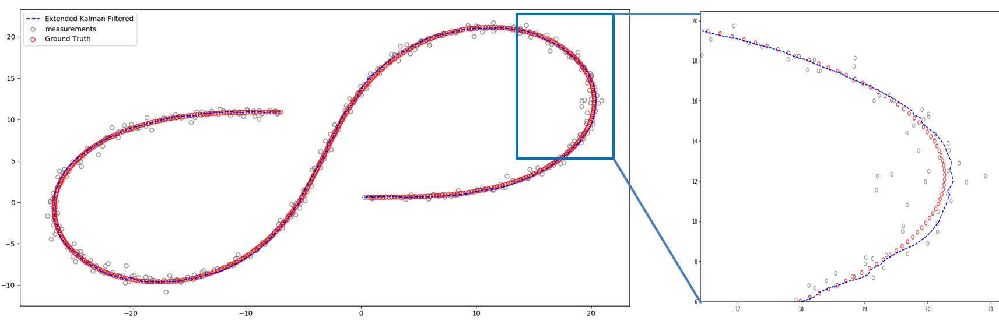
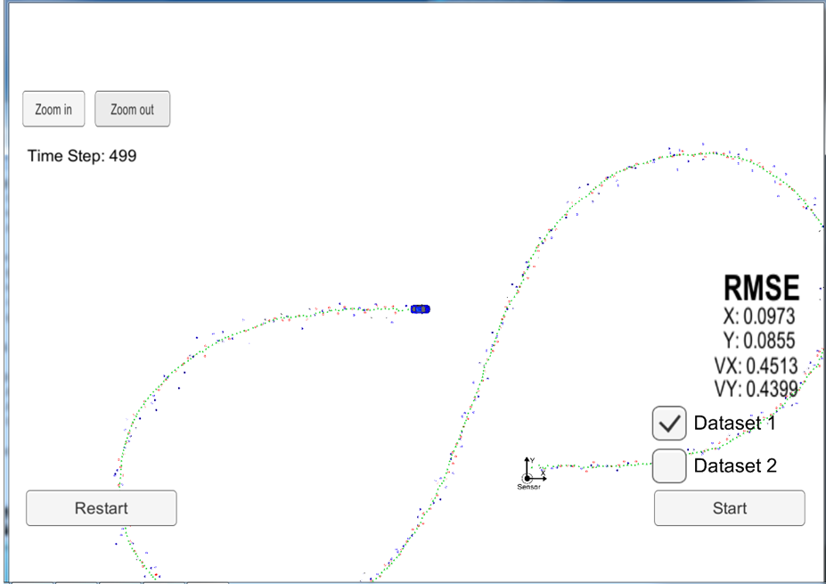
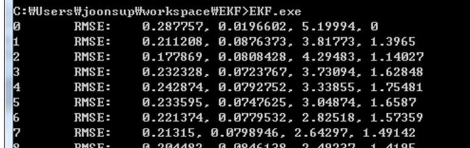

# Extended Kalman Filter Tracking

In this project I implemented extended kalman filter to estimate the state of a moving object of interest with noisy lidar and radar measurements. The python version and the C++ version of the extended kalman filter are included. This project is part of udacity's self-driving car nanodegree course.


## 1. Python Implementation

Python is the best language for validating mathematical formula implementations and algorithms. I like to verify algorithm flow with python before implementing algorithms in C/C++.

This project also implemented the extended kalman filter in the `` `python`` directory. If you run `` `python / main.py``, you can see the following figure.



## 2. C++ implementation

The simulator provided by Udacity is very suitable for final evaluation because it is accompanied by a visual effect. However, the build process is complicated, especially in windows environments.

For this reason, it is not suitable for debugging purposes. So I created a version that reads and tracks the data file directly. The c ++ implementation of this version only uses the gcc built-in library and Eigen, so it's easy to configure the build environment and is suitable for debugging purposes.

#### 1) Simulator Version

This version is in ```simulator-stable``` branch. Please refer to [udacity original repo](https://github.com/udacity/CarND-Extended-Kalman-Filter-Project) for instructions on how to build and run it.



#### 2) Debug Version

This version is in ```master``` branch. The only way to do this is to run the make command from the project root. gcc/g++ compiler is required, and there is no other reference library.

* gcc/g++ >= 5.4
  * Linux: gcc / g++ is installed by default on most Linux distros
  * Mac: same deal as make - [install Xcode command line tools](https://developer.apple.com/xcode/features/)
  * Windows: recommend using [MinGW](http://www.mingw.org/)



As shown above, only RMSE value is output.


